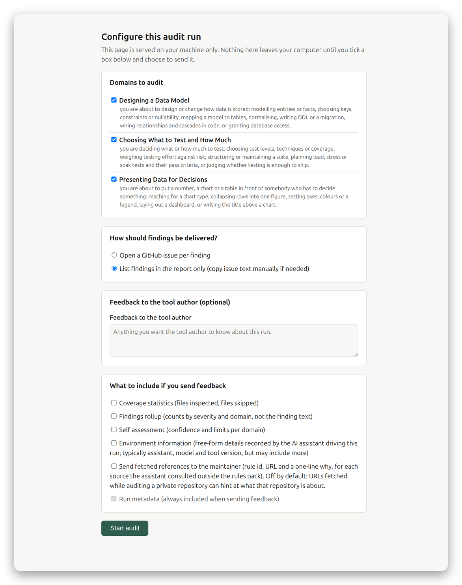
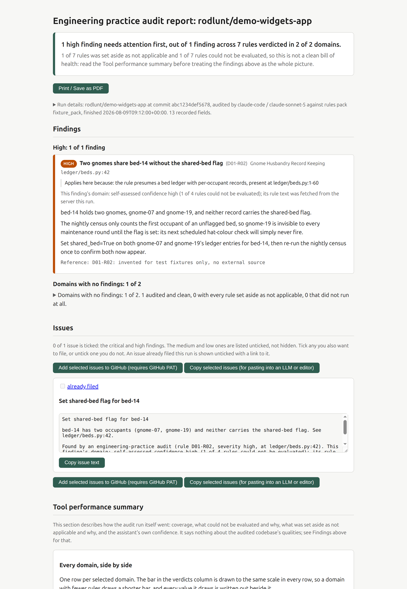
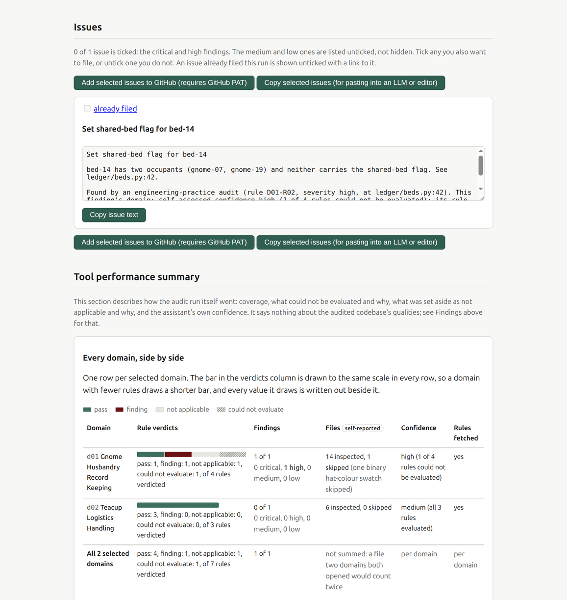

# engineering-audit


**TL;DR:** engineering-audit turns the AI coding assistant you already use (Claude Code,
Codex CLI, Gemini CLI) into an engineering-practice auditor. It has **two audit modes**:

1. **Full repository audit**: your assistant sweeps a whole repository against a pack of
   sourced engineering rules and produces a self-contained HTML report. Every finding says
   what is wrong, why it matters and how to fix it, with the citation behind the claim
   attached, and can be filed as a GitHub issue or copied out for pasting anywhere.
2. **Inline decision-time checks**: one-line triggers in your assistant's context make it
   load the relevant rules at the moment you are making a matching decision (designing a
   schema, cutting a branch, shaping an API). No report, just the right rules at the right
   moment.

Starting a new project? The optional [Engineering Grill](integrations/engineering-grill/)
uses the same rules before you build. Your assistant interviews you, works out which domains
matter, and records the decisions and checks the project will need, without expecting you to
understand the framework first.

**Three complete rule domains ship in this repository**, ready to run: data modelling,
testing strategy and presenting data, 54 rules with their full source citations, in
[examples/taster-rules/](examples/taster-rules/). You can run a real audit right now with
no sign-up; the full sixteen-domain, 260-rule pack is available on request
([Rules access](#rules-access)).

**[Save me the chit chat: show me how to install it →](#how-to-use)**

| Configure a run | Report |
|---|---|
| <picture><source media="(prefers-color-scheme: dark)" srcset="docs/images/config-page-dark.png"></picture> | <picture><source media="(prefers-color-scheme: dark)" srcset="docs/images/report-dark.png"></picture> |

<picture><source media="(prefers-color-scheme: dark)" srcset="docs/images/issues-feedback-dark.png"></picture>

## How to use

From nothing to a first audit in five steps. The taster rules ship in this repository, so
none of this needs access to the full pack.

### Step 1: pick your assistant

The tool works through the assistant you already drive: **Claude Code** (proven end to
end), **OpenAI Codex CLI** or **Gemini CLI** (both documented, not yet exercised end to
end; see the [support matrix](#support-matrix)). GitHub Copilot is not supported.

### Step 2: dependencies

| Dependency | Why you need it | Check it |
|---|---|---|
| [uv](https://docs.astral.sh/uv/) | runs the MCP server via `uvx` straight from a pinned release tag, and installs its own Python (3.10+) if the machine lacks one | `uvx --version` |
| git | clones this repository for the taster rules, and any other rules pack | `git --version` |
| your assistant's CLI | drives the audit and hosts the MCP registration | `claude --version` (or `codex`, `gemini`) |
| GitHub CLI `gh`, optional | only if the assistant should file findings as GitHub issues; filing from the report page instead needs only a PAT in your browser | `gh auth status` |

There is no `pip install` and no npm anywhere: `uvx` fetches and runs the tagged release
directly.

### Step 3: get the rules onto disk

Clone this repository. The taster pack (the three complete domains named in the TL;DR) is
a working rules directory at `examples/taster-rules/`:

```sh
git clone https://github.com/rodlunt/engineering-audit
cd engineering-audit
```

Have the full pack instead? Registration below is identical, just point `--rules-dir` at
that clone's `domains/` directory. See [Rules access](#rules-access) for how to ask.

### Step 4: register the tool with your assistant

Every command below is pinned to the current release tag (`@v0.15.0`) rather than the
moving `main` branch: an unpinned git dependency resolves to whatever `main` holds at
install time and silently moves on later cache refreshes. Find the latest tag on [the
Releases page](https://github.com/rodlunt/engineering-audit/releases). Updating to a newer
tag is a deliberate act with its own command, below, not something that happens on a
`git pull`: the pin lives in your assistant's MCP registration, not in this repository.

Paths beginning with `/path/to/` are placeholders. Replace them with the real absolute path
on your computer; run `pwd` inside a folder when you need to see its absolute path.

#### Claude Code

Register the server (swap in the taster path from Step 3, or your full-pack path):

```sh
claude mcp add engineering-audit --scope user -- uvx --from git+https://github.com/rodlunt/engineering-audit@v0.15.0 \
    engineering-audit-mcp --rules-dir /path/to/engineering-audit/examples/taster-rules
```

`--scope user` registers it for every repository. Without it `claude mcp add` defaults to
local scope, which registers the server for the current directory alone and leaves it
unavailable everywhere else. That failure is silent and lands later (issue #245): a skill
run in any other project reports `list_domains` unavailable with nothing pointing at scope
as the cause. If that happens, run `claude mcp list` in the project where it failed; if
`engineering-audit` is missing there but present in the directory you installed from, it
was registered without `--scope user`. Fix it with `claude mcp remove engineering-audit`
followed by the add command above.

**To update to a newer tag**, remove first and re-add. `claude mcp add` refuses to
overwrite an existing name (`MCP server engineering-audit already exists in user config`),
so changing the tag on its own is not enough:

```sh
claude mcp remove engineering-audit
claude mcp add engineering-audit --scope user -- uvx --from git+https://github.com/rodlunt/engineering-audit@v0.15.0 \
    engineering-audit-mcp --rules-dir /path/to/engineering-audit/examples/taster-rules
```

**The change only takes effect in a new session.** The one you are in keeps the server it
started with, so verify after restarting rather than before:

```sh
claude mcp list | grep engineering-audit    # must show the tag you just set
```

`begin_run`'s response states `tool_version` too. If it names the old version, the session
predates the re-registration and the run is not exercising the build you think it is.

Install the audit skill (gives you a natural-language entry point: "audit this repo"):

```sh
cd /path/to/engineering-audit
scripts/install-skills.sh audit
```

It copies rather than symlinks, so the installed skill does not change under you when this
checkout switches branch. `scripts/install-skills.sh --check` reports when a copy is stale.

Full details: [integrations/claude-code/](integrations/claude-code/).

#### OpenAI Codex CLI

Register the server (verified against codex-cli 0.114.0):

```sh
codex mcp add engineering-audit \
    --env ENGINEERING_AUDIT_RULES_DIR=/path/to/engineering-audit/examples/taster-rules \
    -- uvx --from git+https://github.com/rodlunt/engineering-audit@v0.15.0 engineering-audit-mcp
```

Inline mode: generate the trigger fragment and append it to your repo's `AGENTS.md` (or
`~/.codex/AGENTS.md` for all repos):

```sh
uvx --from git+https://github.com/rodlunt/engineering-audit@v0.15.0 engineering-audit-fragments \
    --rules-dir /path/to/engineering-audit/examples/taster-rules --out-dir .
cat AGENTS-fragment.md >> AGENTS.md
```

Standalone audit: in a `codex` session, ask it to read AUDIT.md from this repository and
run the audit. Headless notes and caveats: [integrations/codex/](integrations/codex/).

#### Gemini CLI

There is no packaged extension. Gemini CLI resolves an extension only from a repository
root, which would put a manifest, a `GEMINI.md` and a `commands/` directory in the root of a
tool that also serves Claude Code and Codex, and none of it was ever exercised against a real
Gemini CLI. Registering the server by hand is one paste and has no such cost.

Add the server to `~/.gemini/settings.json` (or a project-level `.gemini/settings.json`),
swapping in the taster path from Step 3:

```json
{
  "mcpServers": {
    "engineering-audit": {
      "command": "uvx",
      "args": [
        "--from",
        "git+https://github.com/rodlunt/engineering-audit@v0.15.0",
        "engineering-audit-mcp"
      ],
      "env": {
        "ENGINEERING_AUDIT_RULES_DIR": "/path/to/engineering-audit/examples/taster-rules"
      }
    }
  }
}
```

Then start `gemini` in the repository you want audited and paste:

```
Audit this repository against the engineering rules. Read AUDIT.md from the
engineering-audit repository and follow it, driving the engineering-audit MCP tools
through to a rendered report.
```

Inline triggers work too, and need no extension: generate the fragment and merge it into
whichever `GEMINI.md` tier you want it to apply to.

```sh
uvx --from git+https://github.com/rodlunt/engineering-audit@v0.15.0 engineering-audit-fragments \
    --rules-dir /path/to/engineering-audit/examples/taster-rules --out-dir .
cat GEMINI-fragment.md >> GEMINI.md
```

Gemini support is **documented, untested**: Gemini CLI was not available to exercise any of
it. Check `gemini --help` before an unattended run. Details and caveats:
[integrations/gemini/](integrations/gemini/).

### Optional: plan before you build

Install [Engineering Grill](integrations/engineering-grill/) after registering the MCP server
if you want a guided, plain-English planning conversation before code is written. It reads the
domains from the connected rules pack, so the taster pack gives a three-domain grill and the full
rules pack gives the complete framework.

#### Headless / CI

Skip the interactive configuration page by pointing `ENGINEERING_AUDIT_CONFIG` at a saved
configuration JSON (shape documented in [AUDIT.md](AUDIT.md)); `get_config` then returns
immediately. Example driver, Claude Code:

```sh
claude -p "Read AUDIT.md at <path> and audit this repository via the engineering-audit \
MCP tools." --mcp-config mcp.json --allowedTools "mcp__engineering-audit__*,Read,Glob,Grep"
```

Every run also checks this repository's tags for a newer release, on by default (see
[Security](SECURITY.md) for what that discloses). On an air-gapped machine, or anywhere the
network cost or the call itself is unwanted, pass `--no-update-check` to `engineering-audit-mcp`
or set the `ENGINEERING_AUDIT_NO_UPDATE_CHECK` environment variable.

#### What keeps the staleness checks working

Two checks tell you whether what you are running is current: one for the tool, one for the rules
pack. Neither ever guesses. A check that could not run reports `could-not-check`, which is a
distinct state from `current`, so a stale build is never reported as fine. What that honesty does
not do is tell you when a check has gone blind, and both go blind on install shapes that look
perfectly ordinary.

| Check | Attached when | Blind when | What you lose |
|---|---|---|---|
| Tool build | installed from a git URL, which is what every command in Step 4 does | installed from a downloaded archive or a plain wheel, or run from a local or editable checkout | nothing warns you that a pin left on an old tag, or a stale `uvx` cache, is serving an old build |
| Rules pack | the rules directory is a git clone with an `origin` remote, which is what Step 3 produces | the rules arrived as a downloaded zip, were vendored into another repository, have no remote, or have uncommitted changes | nothing warns you that the run is judging your repository against superseded rules |

Following Step 3 and Step 4 as written keeps both attached: `git clone` for the rules, and
`uvx --from git+...@<tag>` for the tool. Any other shape still runs and still audits correctly.
It just cannot tell you it is out of date.

The provenance rows in the report header carry the answer for the run in front of you. Both
reading `could-not-check` at once is the combination to watch for, because that is a build of
unknown age judging your repository against rules of unknown age, with nothing able to detect
either.

### Step 5: run your first audit

Ask your assistant to audit the repository you have open ("audit this repo against the
engineering rules"), tick the domains on the configuration page that opens, wait for the
sweep, then open `audit-output/report.html`. What to expect while it runs is in
[What a run looks like](#what-a-run-looks-like); what it costs in tokens is in
[What a full run costs](#what-a-full-run-costs).

## Engineering Grill, before the code exists (BETA)

**Status: beta, and the label is meant literally.** The interview shipped in v0.13.0 as a separate
`interrogate` skill and was folded into Engineering Grill by issue #239: one pre-build skill, not
two. **Nobody has yet completed a full interactive session with it.** Expect it to change.

An audit sweeps the rules over a repository that already exists. Engineering Grill runs them the
other way, as questions about work that has not started. It classifies **every domain the pack
returns**, derives the full question set from the rules of those whose triggers genuinely fire,
then puts **the highest-consequence questions first**, one at a time, in the Hot Seat. The rest
are held, not discarded: it names the total, offers a deep dive through everything remaining, and
records what was answered, what was deferred and what was never asked.

Triage is global on purpose. One domain's third-best question routinely matters more than
another's first, and a per-domain ranking cannot see that. Questions carry a reversibility grade
and a blast radius so they can be compared across domains at all.

The rule that shapes the whole design is that **no full domain document enters the conversation
with the user**. That is stated as an invariant rather than an architecture: sub-agents satisfy it
where the host has them, serial read-and-discard satisfies it where the host does not, which is
what keeps one skill shippable on more than one assistant.

Ten of the sixteen domains are design-time by their own `Load this when:` statements, so most of
the pack was already pointed at the moment before the code, with nothing to deliver it there.

It never starts a run. It calls `list_domains` and `get_domain` only, both of which work with no
run in progress, so it works on a directory that is not a repository yet or on nothing but a
description. Setup is in [integrations/engineering-grill/](integrations/engineering-grill/), and
the optional hook that offers it when plan mode starts is in
[integrations/claude-code/README.md](integrations/claude-code/README.md).

**What has been exercised:** question derivation on three domains (d02, d01, d15) against one
brief, the no-run guarantee, and the hook's failure paths.

**What has never been run even once:** the cross-domain triage. It is the newest part and the
part everything else now depends on, so treat its output with more suspicion than the rest.

**What has not:** the other thirteen domains, and the interactive loop itself with a real person
answering. Nobody has yet finished a full interrogation. Until they have, treat the shape of the
session as unproven and the question quality as sampled rather than measured.

This is a beta of a Claude Code integration specifically. There is no Codex or Gemini equivalent,
and unlike `audit` there is no assistant-neutral protocol document behind it: the skill file is
the whole specification. That is deliberate for now and is the first thing to change if it earns
its place.

## Scope

This documentation states functional behaviour (what the tool does) and the security and
privacy properties documented inline (how the access token is held, what telemetry you opt
into, what leaves your machine and when). The two human-facing surfaces, the configuration page
and the report page, target [WCAG 2.2](https://www.w3.org/TR/WCAG22/) Level AA. Applying the
same [proven versus documented, untested](#support-matrix) distinction used below for the
assistant integrations: one criterion is proven, the rest are documented, untested. Contrast is
machine-checked on every test run, `tests/test_report_stylesheet.py` computes contrast ratios
from the CSS custom properties and asserts 4.5:1 in both the light and dark palettes. No
keyboard-only pass and no screen reader pass has been recorded against either surface, and
neither template currently sets an explicit minimum target size on its interactive controls, so
those criteria (and WCAG 2.2's target size, success criterion 2.5.8, specifically) have not been
checked by anyone. The target is real; only the contrast ratio has a recorded check behind it.
Performance is explicitly out of scope for now: no throughput or latency target is stated or
tested anywhere in this repository.

## How it works

The tool is a local MCP server (Python, stdio). It points at a local directory of rule
documents and serves them to the agent driving the audit. The agent supplies the judgement;
the server supplies everything that must not depend on an LLM's memory: schema-validated
finding capture (a rule the agent did not check can never be recorded as a pass), the
configuration page, deterministic report rendering, source citations attached from the
rules pack itself, and GitHub issue filing with an explicit confirmation step.

Two audit modes, plus an optional project-start skill:

- **Engineering Grill**: before code is written, the assistant sorts the loaded domains by
  relevance, asks framework-backed questions and records the resulting plan. It uses only the
  read-only `list_domains` and `get_domain` tools and does not start an audit run.
- **Standalone audit**: tick the domains to audit on a local configuration page (or supply
  a saved config for headless runs), the agent sweeps the repository, and you get
  `report.html` plus optional GitHub issues.
- **Inline**: one-line triggers merged into your assistant's instruction context tell it to
  call `get_domain(...)` at decision moments (designing a schema, cutting a branch, shaping
  an API), so the rules arrive exactly when they are useful.

## Support matrix

| Assistant | Inline mode | Standalone audit |
|---|---|---|
| Claude Code | proven (in daily use via skills) | proven (recorded run 2026-08-09) |
| OpenAI Codex CLI | documented, untested | proven (recorded run 2026-08-10) |
| Gemini CLI | documented, untested | documented, untested |
| GitHub Copilot | unsupported | unsupported |

"Proven" means a recorded end-to-end run exists. "Documented, untested" means the
integration follows the assistant's official documentation, with individually verified
pieces labelled in the integration README, but no full audit has been exercised on it yet.
Copilot is deliberately unsupported rather than silently absent.

## What a run looks like

A standalone audit is a conversation plus one browser page. From your seat:

1. **Ask for the audit** ("audit this repo against the engineering rules"). The assistant
   gathers run metadata and starts the run.
2. **A configuration page opens in your browser** (`http://127.0.0.1:<port>/`). Opening it
   is best-effort: in a remote or display-less session no tab can appear, so the assistant
   also prints the URL; open it yourself if nothing popped up. Tick the domains to audit,
   choose report-only or GitHub issue filing, and submit. Nothing proceeds until you
   submit: the tool never falls back to a domain selection you did not make.
3. **The assistant sweeps the repository** domain by domain. This is the slow part:
   minutes for a small repository and a few domains, longer for a big selection. You can
   ask for progress; it can report which domains are recorded and which remain.
4. **Everything lands in `audit-output/` inside the audited repository**: `report.html`
   (the deliverable, openable in any browser; the assistant offers to open it when the
   run finishes) and `run-state.json` (the raw machine-readable results, which can
   re-render the same report later via `engineering-audit-render`). If you chose GitHub
   filing, the assistant previews the issues and asks before filing anything.

`audit-output/` belongs to the audited repository, not to this tool. Commit it, ignore it
or delete it as that repository's own conventions dictate.

## What a full run costs

A full sweep is token-hungry, and the configuration page's domain tick boxes are the cost
control: cost scales close to linearly with the domains you tick. Budget from these
recorded runs rather than guessing, one row per host that has completed one:

| Host | Tool version | Scope | Active time | Findings | Tokens |
|---|---|---|---|---|---|
| Claude Code, Fable 5 orchestrating Sonnet subagents (this repository, 2026-08-09) | 0.4.0 (established from tag history, not stamped into a retained report; see [docs/example-audit-cost.md](docs/example-audit-cost.md)) | all 16 domains, 260 rules | 47 minutes end to end, sweeps running four at a time | 33 (every one filed as a GitHub issue) | 2,010,691 subagent tokens, roughly 100k to 170k per domain (excludes the orchestrator) |
| Codex CLI 0.147.0, gpt-5.6-sol at high reasoning effort (external React SPA, roughly 344 files, 2026-08-10) | 0.5.1 | all 16 domains of the standard pack | 19 minutes 21 seconds | 32 (122 rules could not be evaluated) | 6,172,397 input plus output, of which 96% is cached input; 269,293 non-cached input plus output |

Both rows predate `v0.9.0` and `v0.9.1`, which added required per-finding and per-domain
output that neither run had to produce; see the comparability note in
[docs/example-audit-cost.md](docs/example-audit-cost.md) before budgeting a current run from
either figure.

**The two token columns are not the same measurement and must not be subtracted or
averaged.** Codex does not fan out to one subagent per domain the way the Claude Code skill
does, and that single difference drives everything: fanning out gives each subagent a small
fresh context and bills mostly uncached input, while staying in one long context re-reads a
large accumulated context every turn. Hence Codex's 6.17M being 96 per cent cache reads.
The Claude Code figure counts per-subagent totals and excludes the orchestrator conversation
entirely. Use each row within itself, for the shape of run it describes. Full per-host
detail, including what each run did and did not measure, is in
[docs/example-audit-cost.md](docs/example-audit-cost.md).

## The report

Self-contained HTML, generated locally; nothing leaves your machine unless you choose to
send or file it. It is a written report meant to be read top to bottom, in this order:

- A **computed headline**, first thing on the page: one sentence naming what needs
  attention first, built from the run's own counts, with a second line saying what was set
  aside or could not be evaluated so a partial sweep cannot read as a clean bill of health.
- **Findings**, sorted worst first rather than in the order they were recorded, each in
  three parts (the issue and location, why it matters, suggested fix) with the rule's
  citation appended automatically from the rules pack. The tool refuses to publish a
  finding whose rule carries no citation. Each finding also carries its domain's
  self-assessed confidence and whether that domain's rule text was fetched this run, so a
  finding from a shaky domain does not look identical to one from a solid one. The
  confidence never appears on its own: it ships with how many of that domain's rules could
  not be evaluated, out of how many, so a domain claiming high confidence over half a
  domain it could not check says so in the same breath. The four
  severity levels are defined on the page, and stated as assigned by the assistant named
  in the header rather than measured.
- **Issues**: tick boxes to select findings, then file them to GitHub directly from the
  report (fine-grained PAT, used in memory only, sent only to api.github.com), or copy the
  selected set for pasting into an LLM or editor, or copy them one at a time. Only critical
  and high findings are ticked on load; nothing is hidden, and an already-filed finding
  shows unticked with a link to it.
- A **tool performance summary** about the audit run itself, below the findings rather
  than above them: one table with a row per domain carrying rule verdicts, findings by
  severity, files inspected and skipped, confidence and fetch status, with the
  could-not-evaluate and not-applicable reasons in full, and an **evidence boundary** block
  naming what each domain did not read. Every number ships with its base, a domain set
  aside in full cannot read as a domain swept clean, an unchecked rule is never presented
  as a pass, and a value the tool was told rather than measured says so. Longer sections
  sit behind summaries that each carry their own numbers, so the detail is one click away
  rather than occupying the top of the page.
- **Feedback to the author**: freeform text, two optional questions asking what you
  concluded from the report and what you would fix first, and tick-box consent over which
  run statistics accompany any of it. Everything here is off by default and never
  prefilled. Finding text never leaves your machine through this channel.

It prints sensibly too: the issue-filing section is dropped from print rather than clipped,
with a line saying where to find it, and collapsed sections are expanded on paper.

A live example: [docs/demo/report.html](docs/demo/report.html) (download and open locally;
GitHub does not render raw HTML in the browser). Generated from the invented demo rules pack
in `tests/fixture_pack`, not a real audit against a real repository.

## The rules

The author's rules pack covers sixteen decision domains, 260 rules in all, each rule
carrying a cited source, a volatility tier and a verification date, and each domain proven
against a real system before it is trusted:

| # | Domain | Rules | Fires when you are... |
|---|---|---|---|
| d01 | Designing a Data Model | 15 | modelling entities, choosing keys, constraints, normalising, writing DDL or migrations |
| d02 | Eliciting and Specifying Requirements | 16 | deciding what to build, writing requirements or user stories, checking the right problem is being solved |
| d03 | Modelling Structure and Behaviour Before Building | 15 | deciding what to diagram before coding, drawing or reviewing FMC/UML/SysML models |
| d04 | Structuring Code and Applying Design Patterns | 14 | designing classes or modules, weighing a design pattern, choosing data structures or error handling |
| d05 | Choosing What to Test and How Much | 18 | choosing test levels and coverage, weighing testing against risk, planning load or soak tests and CI gates |
| d06 | Structuring a Repo, Branches and CI/CD | 15 | structuring a repository, writing CI/CD workflows, handling automation credentials, cutting releases |
| d07 | Handling Untrusted Input and Secure Coding | 16 | writing code untrusted input can reach: forms, auth flows, credentials, sessions |
| d08 | Threat Modelling and Security Risk Decision-Making | 15 | running a risk assessment, threat-modelling a system, prioritising vulnerabilities, justifying a control |
| d09 | Responding When Something Breaks in Production | 16 | writing incident response plans, defining recovery objectives, running post-incident reviews |
| d10 | Designing APIs and Service Contracts | 14 | creating or extending an HTTP API, choosing verbs and status codes, versioning or deprecating an interface |
| d11 | Choosing Architecture and Deployment Topology | 16 | picking an application architecture, deciding VM/container/serverless topology, planning scaling and rollout |
| d12 | Making an Ethical or Professional Judgement Call | 17 | facing pressure to cut a corner, decisions affecting users or the public, handling personal data |
| d13 | Estimating and Pricing Work | 16 | scoping work before quoting, choosing estimation methods, setting contingency, defending an estimate |
| d14 | Fault Diagnosis of a Running System | 19 | investigating an outage, a slow or wrong-answering service, or an intermittent bug |
| d15 | Interface Design and Prototyping | 17 | laying out a screen, designing a form, writing button and error copy, deciding confirmation vs undo |
| d16 | Presenting Data for Decisions | 21 | putting a number, chart or table in front of somebody who has to decide something |

### Try it right now: the taster pack

Three complete domains (d01, d05, d16, 54 rules with their full source citations) are
published in [examples/taster-rules/](examples/taster-rules/) as point-in-time exports
from the maintained pack. They are a working rules directory, and they are what the
[How to use](#how-to-use) steps register by default: run a real audit before asking for
anything.

### Rules access

The full pack lives in a private repository with access granted per user (the maintained
originals, their revision history and proving records). Ask via the
[rules pack access request form](https://github.com/rodlunt/engineering-audit/issues/new?template=rules-access.yml). The
tooling works with any rules directory in the expected format (`**Trigger:**` header,
`### N. Title` rules, `Rule id:` footers with `Source:` fragments), so you can also write
your own pack.

## Development

```sh
uv sync
uv run pytest -q
```

CI runs the same suite on every push and pull request. Tests use an invented fixture rules
pack; no private rule content exists in this repository. The renderer and configuration
page are deterministic and fully testable with no LLM involved.

This is a solo-maintainer repository, and its merge gate is deliberately CI-only: every change
lands via a pull request that must pass the `check` status; no human review requirement is
configured.

### Tracking issues and PRs

Up to now, the PR description has been the deliberate change record for this project: each PR
body explains what changed and why, and that has been treated as sufficient in place of a
separate issue-linked history. From now on, every PR that has a tracking issue links it with a
`Closes #N` line (or `Fixes #N`), so the issue tracker and the merge history stay in step
instead of relying on the PR description alone. Release PRs (`chore(release): X.Y.Z`) and
housekeeping PRs with no issue behind them are the standing exception: there is nothing for
either to close, so no keyword is expected on them. Nothing currently checks for the keyword on
a PR that does carry a tracking issue; a CI check failing a PR with no closing keyword and no
opt-out label is an option the maintainer can pick up separately, not something this policy
statement adds on its own.

### Eval harness

`evals/` holds a deterministic scorer for audit quality: a small fictional golden repository with
known planted findings and controls, and `engineering-audit-eval` to check a run-state.json
against them. The scorer is CI-safe and has its own tests; the audit run that feeds it calls a
real LLM and is run and checked by hand. See [evals/README.md](evals/README.md).

## Roadmap

- Thin CLI wrapper driving an agent CLI headlessly end to end (a manual, scripted version of this
  now lives in [evals/README.md](evals/README.md); a first-class wrapper command is still open).
- Remotely served rules with revocable access.
- Codex and Gemini support-matrix rows moving to proven once live runs are recorded.

## Licence

The tooling in this repository (the MCP server, the deterministic report renderer, the
configuration page, and every supporting script) is licensed under [Apache-2.0](LICENSE).
Rules packs are licensed separately and are not covered by this repository's licence; see
[Rules access](#rules-access).

---

<sub>Built by [Rodney Lunt](https://rod.lunt.au). If this saved you some time, you can [buy me a coffee](https://buymeacoffee.com/rodlunt).</sub>
