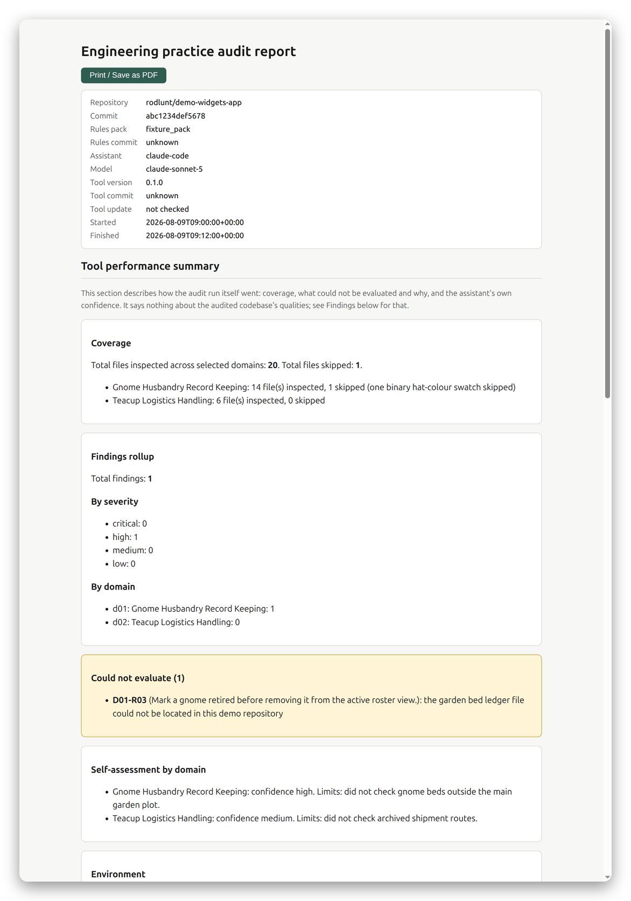
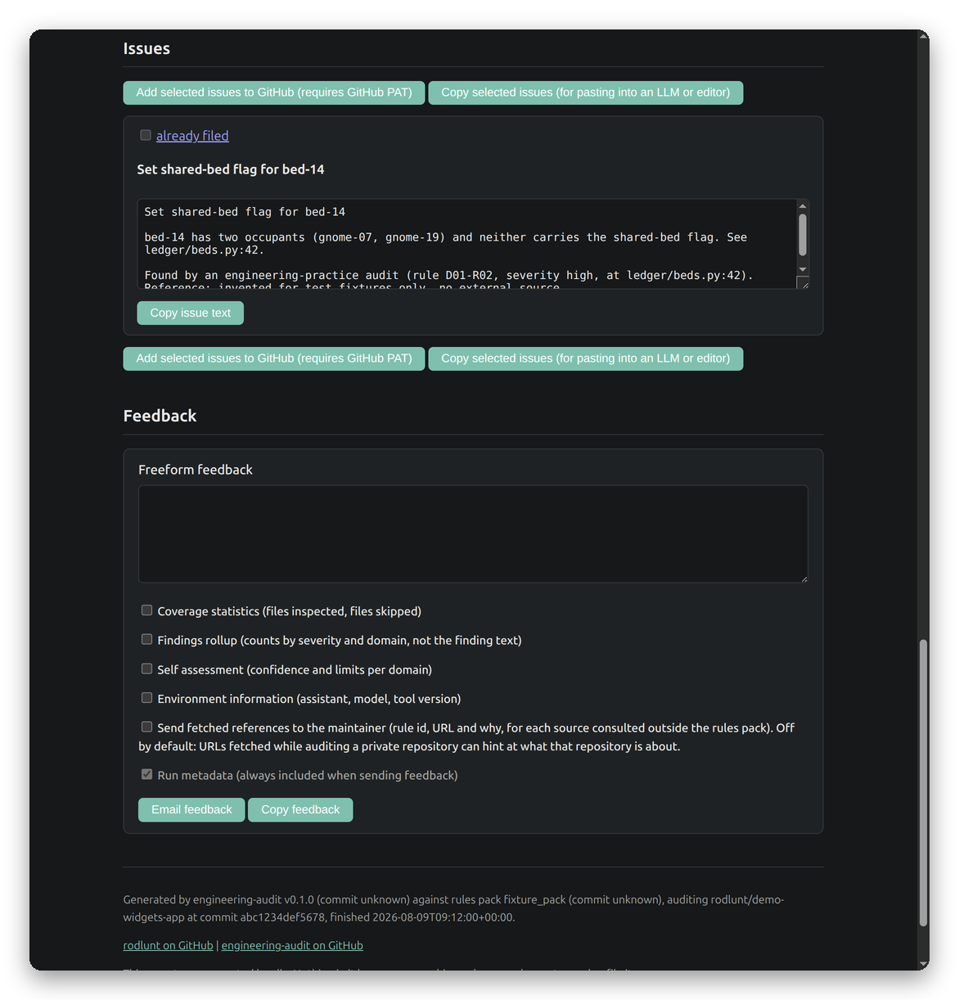

# engineering-audit

**TL;DR:** an engineering-practice audit tool for AI coding assistants (Claude Code, Codex
CLI, Gemini CLI). Your assistant sweeps a repository against a pack of sourced engineering
rules and produces a self-contained HTML report: every finding says what is wrong, why it
matters, and how to fix it, with the citation behind the claim attached. Findings can be
filed as GitHub issues (from the assistant, or straight from the report with a PAT) or
copied out for pasting anywhere. It also works inline, nudging your assistant to load the
relevant rules at the moment of a decision. If you want audited-by-evidence engineering
practice checks inside the tools you already use, this is for you; you will need access to
a rules pack (see [Rules access](#rules-access)).

| Configure a run | Report |
|---|---|
|  |  |



## How it works

The tool is a local MCP server (Python, stdio). It points at a local directory of rule
documents and serves them to the agent driving the audit. The agent supplies the judgement;
the server supplies everything that must not depend on an LLM's memory: schema-validated
finding capture (a rule the agent did not check can never be recorded as a pass), the
configuration page, deterministic report rendering, source citations attached from the
rules pack itself, and GitHub issue filing with an explicit confirmation step.

Two modes:

- **Standalone audit**: tick the domains to audit on a local configuration page (or supply
  a saved config for headless runs), the agent sweeps the repository, and you get
  `report.html` plus optional GitHub issues.
- **Inline**: one-line triggers merged into your assistant's instruction context tell it to
  call `get_domain(...)` at decision moments (designing a schema, cutting a branch, shaping
  an API), so the rules arrive exactly when they are useful.

## Support matrix

| Assistant | Inline mode | Standalone audit |
|---|---|---|
| Claude Code | proven (in daily use via skills) | proven (recorded run 2026-08-09) |
| OpenAI Codex CLI | documented, untested | documented, untested |
| Gemini CLI | documented, untested | documented, untested |
| GitHub Copilot | unsupported | unsupported |

"Proven" means a recorded end-to-end run exists. "Documented, untested" means the
integration follows the assistant's official documentation, with individually verified
pieces labelled in the integration README, but no full audit has been exercised on it yet.
Copilot is deliberately unsupported rather than silently absent.

## Install

The server runs with [uv](https://docs.astral.sh/uv/) (Python 3.10+), either straight from
this repository via `uvx` or from a local clone. Every assistant needs the same two things:
the MCP server registered, and a rules pack on disk to point it at.

<details>
<summary><strong>Claude Code</strong></summary>

Register the server:

```sh
claude mcp add engineering-audit -- uvx --from git+https://github.com/rodlunt/engineering-audit \
    engineering-audit-mcp --rules-dir /path/to/rules-clone/domains
```

Install the audit skill (gives you a natural-language entry point: "audit this repo"):

```sh
ln -s /path/to/engineering-audit/integrations/claude-code/audit ~/.claude/skills/audit
```

Then ask Claude Code to audit the repository you have open. It follows
[AUDIT.md](AUDIT.md): you pick domains on the configuration page, it sweeps, you get the
report. Full details: [integrations/claude-code/](integrations/claude-code/).

</details>

<details>
<summary><strong>OpenAI Codex CLI</strong></summary>

Register the server (verified against codex-cli 0.114.0):

```sh
codex mcp add engineering-audit \
    --env ENGINEERING_AUDIT_RULES_DIR=/path/to/rules-clone/domains \
    -- uvx --from git+https://github.com/rodlunt/engineering-audit engineering-audit-mcp
```

Inline mode: generate the trigger fragment and append it to your repo's `AGENTS.md` (or
`~/.codex/AGENTS.md` for all repos):

```sh
uvx --from git+https://github.com/rodlunt/engineering-audit engineering-audit-fragments \
    --rules-dir /path/to/rules-clone/domains --out-dir .
cat AGENTS-fragment.md >> AGENTS.md
```

Standalone audit: in a `codex` session, ask it to read AUDIT.md from this repository and
run the audit. The full flow is documented but not yet exercised end to end on Codex; see
[integrations/codex/](integrations/codex/) for headless notes and caveats.

</details>

<details>
<summary><strong>Gemini CLI</strong></summary>

Everything for Gemini ships as an extension (documented, untested: Gemini CLI was not
available to exercise it; check `gemini --help` against the README's flags before an
unattended run):

```sh
gemini extensions install https://github.com/rodlunt/engineering-audit
```

The extension registers the MCP server, adds an `/audit` command, and carries the inline
trigger fragment as its context file. Manual alternative and details:
[integrations/gemini/](integrations/gemini/).

</details>

<details>
<summary><strong>Headless / CI</strong></summary>

Skip the interactive configuration page by pointing `ENGINEERING_AUDIT_CONFIG` at a saved
configuration JSON (shape documented in [AUDIT.md](AUDIT.md)); `get_config` then returns
immediately. Example driver, Claude Code:

```sh
claude -p "Read AUDIT.md at <path> and audit this repository via the engineering-audit \
MCP tools." --mcp-config mcp.json --allowedTools "mcp__engineering-audit__*,Read,Glob,Grep"
```

</details>

## The report

Self-contained HTML, generated locally; nothing leaves your machine unless you choose to
send or file it. It contains:

- A **tool performance summary** about the audit run itself: coverage, findings rollup,
  a prominent could-not-evaluate list with reasons, the assistant's own per-domain
  confidence. An unchecked rule is never presented as a pass.
- **Findings**, each in three parts (the issue and location, why it matters, suggested
  fix) with the rule's citation appended automatically from the rules pack. The tool
  refuses to publish a finding whose rule carries no citation.
- **Issues**: tick boxes to select findings, then file them to GitHub directly from the
  report (fine-grained PAT, used in memory only, sent only to api.github.com), or copy the
  selected set for pasting into an LLM or editor, or copy them one at a time.
- **Feedback to the author**: freeform text plus tick-box consent over which run
  statistics accompany it. Finding text never leaves your machine through this channel.

A live example: [docs/demo/report.html](docs/demo/report.html) (download and open locally;
GitHub does not render raw HTML in the browser). Generated from the invented demo rules pack
in `tests/fixture_pack`, not a real audit against a real repository.

## Rules access

This repository contains no rule content; the audit cannot run without a rules pack. The
author's pack (16 engineering-practice domains, roughly 260 rules, each carrying a cited
source and a review cadence) lives in a private repository with access granted per user.
Open an issue here to ask. The tooling works with any rules directory in the expected
format (`**Trigger:**` header, `### N. Title` rules, `Rule id:` footers with `Source:`
fragments).

## Development

```sh
uv sync
uv run pytest -q
```

CI runs the same suite on every push and pull request. Tests use an invented fixture rules
pack; no private rule content exists in this repository. The renderer and configuration
page are deterministic and fully testable with no LLM involved.

## Roadmap

- Thin CLI wrapper driving an agent CLI headlessly end to end.
- Remotely served rules with revocable access.
- Codex and Gemini support-matrix rows moving to proven once live runs are recorded.

## Licence

The tooling in this repository (the MCP server, the deterministic report renderer, the
configuration page, and every supporting script) is licensed under [Apache-2.0](LICENSE).
Rules packs are licensed separately and are not covered by this repository's licence; see
[Rules access](#rules-access).
